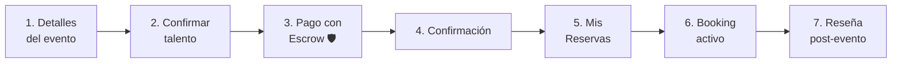
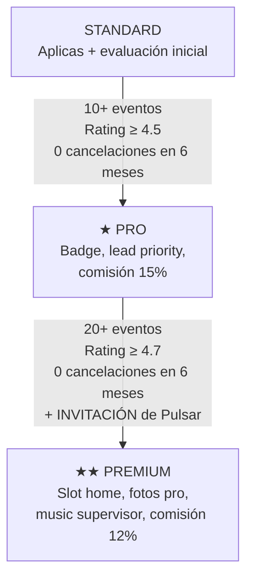

# Pulsar · Resumen de Mockups HTML

Documento que describe el contenido y propósito de los tres mockups de referencia para la plataforma **Pulsar by ShowRoots**, un marketplace de contratación de DJs y talento musical para eventos.

---

## 1. Perfil del DJ — Mockup de Referencia

📄 [Pulsar_DJ_Profile_Mockup.html](file:///C:/Users/PC/Proyectos/SHOWROOTS/Pulsar_DJ_Profile_Mockup.html)

### ¿Qué es?

Es el **mockup completo del perfil público de un DJ** (ejemplo: "Rubs DJ") tal como lo vería un cliente al buscarlo en la plataforma. Funciona como referencia visual para el desarrollo del perfil de talento.

### Estructura del Layout

| Zona | Contenido |
|------|-----------|
| **Navbar** | Logo "PULSAR by ShowRoots", links de navegación (Talentos, Venues), notificaciones, cuenta del usuario |
| **Hero Banner** | Imagen de portada con gradiente, badge "Pago protegido por Pulsar", botón compartir |
| **Sidebar izquierdo (sticky)** | Avatar, nombre, badges (DJ, Premium), rating 4.9★, stats (47 eventos, 6h respuesta), ubicación, idiomas, pricing ($400 desde/4hrs), disponibilidad rápida, CTAs "Reservar Ahora" y "Enviar consulta", card de confianza (escrow) |
| **Contenido principal (derecha)** | 14 secciones modulares |

### Secciones del perfil (14 en total)

| # | Sección | Prioridad | Descripción |
|---|---------|-----------|-------------|
| 1 | 🎵 **Mixes / Audio** | MVP | Player con 3 sets de ejemplo (Wedding Mix, Corporate Cocktail, Peak Time). Embed SoundCloud/Spotify/Mixcloud |
| 2 | 🎬 **Video en vivo** | Pre-launch | Grid 2 columnas con videos de eventos (Boda, Corporativo). Embed YouTube/Vimeo |
| 3 | 👤 **Sobre mí (Bio)** | MVP | Texto libre del DJ describiendo experiencia, enfoque y especialidades |
| 4 | 🎶 **Géneros & estilo** | MVP | Tags de géneros (Electrónica, House, Latin…) y mood/vibe (Boda elegante, After party…) |
| 5 | 📅 **Tipos de eventos** | Pre-launch | Tags de categorías de eventos (Bodas, Corporativo, Cumpleaños, etc.) |
| 6 | 📦 **Paquetes** | Pre-launch | Grid 2x2 con packs predefinidos (Boda Esencial $600, Corporativo $550, Cumpleaños $700, Custom) |
| 7 | 📸 **Galería** | Pre-launch | Grid 4 columnas con fotos de eventos |
| 8 | 🎛 **Equipamiento** | Pre-launch | Dos listas: "Yo traigo" vs "No incluido" — evita malentendidos de producción |
| 9 | 📍 **Cobertura + Idiomas** | — | Zonas de cobertura y idiomas para MC |
| 10 | ⭐ **Reseñas** | MVP | Score general (4.9), breakdown por dimensión (Puntualidad, Selección musical, etc.), lista de reseñas verificadas |
| 11 | 📅 **Disponibilidad** | Pre-launch | Calendario visual mes a mes con días disponibles (verde) y ocupados (rojo) |
| 12 | ❓ **FAQ del DJ** | Iter 2 | Preguntas frecuentes personalizadas del DJ (playlist, requests, setup, MC) |
| 13 | 🛡️ **Cómo funciona** | MVP | 5 pasos explicando el flujo de contratación con escrow. **Sección más importante para generar confianza** |
| 14 | 🌐 **Redes sociales** | Iter 2 | Links a Instagram, TikTok, SoundCloud con stats. Sin link directo (anti-desintermediación) |

### Sistema de prioridades

- 🔴 **MVP** — Bloqueante para el lanzamiento
- 🟡 **Pre-launch** — Importante antes del lanzamiento
- 🟢 **Iter 2** — Para segunda iteración

> [!IMPORTANT]
> Las **notas naranjas (dev-notes)** son comentarios técnicos para el equipo de desarrollo y NO van en producción.

---

## 2. Flujo de Booking del Cliente

📄 [Pulsar_Client_Booking_Flow 5.html](file:///C:/Users/PC/Proyectos/SHOWROOTS/Pulsar_Client_Booking_Flow%205.html)

### ¿Qué es?

Es el **journey completo del cliente** desde que hace click en "Reservar Ahora" hasta que deja una reseña post-evento. Incluye **7 pantallas/estados** que cubren todo el ciclo de vida de una reserva.

### Tabla de contenido del flujo

### Detalle de cada pantalla

#### Pantalla 1 — Detalles del evento
- **Multi-step form** con stepper visual (Evento → Servicio → Producción → Pago)
- **Tiles visuales** para tipo de evento con iconos grandes: 💍 Boda, 🏢 Corporativo, 🎂 Cumpleaños, 🍸 Cocktail (tile seleccionado con borde lime)
- Campos: nombre, fecha, duración, hora de inicio, invitados, ciudad, tipo de espacio, dirección del venue
- **Summary lateral sticky** que se construye en tiempo real mostrando el DJ, tipo de evento, fecha, duración y tarifa

#### Pantalla 2 — Confirmar talento + mensaje
- Card del DJ con stats, badges y botón "Ver perfil completo"
- Selector de géneros musicales (tags removibles)
- Textarea para descripción del evento y mensaje al talento
- Campo de presupuesto estimado

> [!WARNING]
> **Anti-desintermediación activa:** Los textareas escanean automáticamente patrones de contacto (teléfonos, emails, @usernames, "WhatsApp", "llamame"). Si detecta, bloquea el envío y muestra warning.

#### Pantalla 3 — Pago con Escrow 🛡️ (la pantalla más importante)
- **Hero de confianza:** "Tu pago está protegido por Pulsar"
- **Escrow Timeline visual** de 3 pasos: Hoy (pagás a Pulsar) → En custodia ($1,220 protegidos) → 24h post-evento (liberación)
- **Métodos de pago:** Tarjeta, ACH, Yappy (Panamá)
- **Formulario de tarjeta** (Stripe PCI-DSS Level 1)
- **Desglose del pago:** Performance $700 + Pack Sonido Pro $520 + Tarifa Pulsar $36.60 + ITBMS 7% = **$1,344.52**
- **Política de cancelación** escalonada (100% → 50% → 0% según tiempo)
- FAQs inline expandibles

#### Pantalla 4 — Confirmación
- **Hero de éxito** con check animado y código de booking (`PUL-2026-05-A8F3`)
- **Timeline de "qué pasa ahora"** (5 pasos): Pago confirmado → DJ recibe solicitud → Coordinación previa (chat) → Día del evento → 24h post-evento (liberación)
- CTAs: "Ver mis reservas" y "Ir al chat con Rubs"

#### Pantalla 5 — Dashboard "Mis Reservas"
- **Nav propia** con links (Talentos, Venues, Mis Reservas)
- **KPIs:** Próximos eventos (1), En custodia ($1,344.52), Eventos completados (2)
- **Cards de bookings** organizados por estado:
  - ⏰ **Próximos** — con countdown, talent card, detalles y acciones (Chat, Ver detalles, Modificar, Cancelar)
  - ⏳ **Pendientes de respuesta** — esperando confirmación del DJ
  - ✓ **Pasados/Completados** — con reseña enviada y pago liberado

#### Pantalla 6 — Booking activo (countdown + chat)
- **Countdown banner** con días/horas/minutos al evento
- **Chat con el DJ** — Mensajería in-app con filtro anti-desintermediación en tiempo real
- **Resumen lateral** del booking con todos los detalles, estado escrow ("En custodia"), y opciones de descargar contrato, modificar o cancelar

> [!CAUTION]
> El chat filtra en tiempo real cualquier patrón de teléfono, email o @username. Los reemplaza por `***` y muestra warning. Si la frecuencia de intentos sube, escala a admin.

#### Pantalla 7 — Reseña post-evento
- **Rating general** con estrellas interactivas
- **Rating por dimensión:** Puntualidad, Selección musical, Lectura del público, Técnica, Comunicación pre-evento
- Textarea para comentario (mín. 30 caracteres)
- **Incentivos:** Al enviar reseña → se libera pago al DJ, se publica la reseña, y el cliente recibe $50 crédito Pulsar
- Link para "Reportar problema" que retiene el pago al talento

### Elemento recurrente: Escrow

El sistema de **pago en custodia (escrow)** aparece reforzado en cada pantalla:

| Pantalla | Mensaje de escrow |
|----------|------------------|
| Paso 1 (sidebar) | "Tu reserva está protegida. No se cobra nada todavía" |
| Paso 4 (pago) | Timeline visual de 3 pasos + breakdown explícito |
| Confirmación | "Tu dinero está en custodia" |
| Dashboard | KPI "$1,344.52 en custodia" |
| Booking activo | Badge "🛡️ En custodia" en resumen |
| Reseña | "Al enviar, Pulsar libera el pago a Rubs" |

---

## 3. Comparación de Tiers — Standard vs Pro vs Premium

📄 [Pulsar_Tiers_Comparison.html](file:///C:/Users/PC/Proyectos/SHOWROOTS/Pulsar_Tiers_Comparison.html)

### ¿Qué es?

Es una **comparación visual side-by-side** de cómo se ve el mismo DJ ("Rubs DJ") en los 3 niveles de membresía de la plataforma. Muestra **13 secciones comparadas** + tabla resumen + escalera de progresión.

### Los 3 tiers

| | **STANDARD** | **★ PRO** | **★★ PREMIUM** |
|---|---|---|---|
| **Comisión** | 22% | 15% | 12% |
| **Acceso** | Entrada (aplica + evaluación) | 10+ eventos, rating ≥4.5 | **Por invitación de Pulsar** |
| **Color** | Gris | Cyan (#22d3ee) | Gold (#f59e0b) con glow |

### Secciones comparadas (13)

| # | Sección | Standard | Pro | Premium |
|---|---------|----------|-----|---------|
| 1 | **Card en búsqueda** | Sin badge, pocos datos, "Nuevo" | Badge ★ PRO cyan, más genres, rating | Badge ★★ PREMIUM dorado, "CURADO POR PULSAR", glow |
| 2 | **Banner + Header** | Gradiente default, avatar sin borde especial | Banner propio 1 imagen, borde cyan | Foto pro Pulsar + video opcional, borde gold con glow |
| 3 | **Stats + Pricing** | 3 eventos, sin respuesta, solo $/hora | 24 eventos, 6h respuesta, 1 pack custom | 87 eventos, 3h respuesta, 95% repeat, 5 packs + pricing dinámico |
| 4 | **Mixes audio** | 1-2 mixes máximo | Hasta 4 mixes | Ilimitados + mix destacado |
| 5 | **Video** | ❌ No incluido | 1 clip | Hasta 4 + video bio |
| 6 | **Bio** | Máx 200 chars | 500 chars + bullets | Rica + video bio |
| 7 | **Paquetes de precio** | Solo tarifa por hora | 1 pack custom | Ilimitados + pricing dinámico (alta temporada +15%) |
| 8 | **Galería** | 3-5 fotos | Hasta 10 | Ilimitado + sesión fotos pro gratis |
| 9 | **Géneros + Mood** | Solo géneros (3) | Géneros + mood | Géneros + mood + tipos de evento |
| 10 | **Reseñas** | Sin breakdown, vacío inicial | Breakdown por dimensión | Breakdown + **respuesta del DJ a reseñas** |
| 11 | **Calendario** | Disponible / Ocupado manual | + Bloqueo por tipo de evento | + Sync Google/Apple Calendar |
| 12 | **FAQ** | ❌ No disponible | Hasta 3 preguntas | Ilimitadas + Pulsar ayuda a redactar |
| 13 | **Beneficios Pulsar** | Búsqueda orgánica, leads básicos, soporte email 48h | Prioridad búsqueda, lead alerts 24h antes, badge para IG, posts ocasionales, soporte 12h | **Slot permanente en home**, top 3 en búsquedas, lead alerts 48h antes + corporativos, fotos pro gratis, kit marketing co-branded, music supervisor, reels/stories mensuales, WhatsApp directo con manager, 1-on-1 mensual con cofounder |

### Escalera de progresión (Cómo subir de tier)

> [!IMPORTANT]
> **Regla clave:** Premium es **siempre por invitación de Pulsar**, no por métrica automática. Esto preserva la marca "curado" y permite veto si hay quejas que no salen en métricas.

### Protecciones universales (iguales para todos los tiers)

- ✅ Escrow / pago protegido
- ✅ Anti-desintermediación
- ✅ Reembolso 100% si el talento no se presenta

---

## Notas de Diseño Visual (verificado con screenshots)

Tras la revisión visual en navegador, estas son observaciones de diseño relevantes:

### Paleta de colores
- **Fondo principal:** Negro puro `#0a0a0a` / `#000000`
- **Cards:** Gris muy oscuro `#141414` con bordes `#262626`
- **Color primario (CTA):** Lime/verde-amarillo `#c8f04a` — usado en botones, badges, tags de géneros
- **Confianza/Escrow:** Verde esmeralda `#10b981` — todo lo relacionado con seguridad y escrow
- **Premium/Gold:** Ámbar `#f59e0b` — badges premium, pricing dinámico, alertas de pago
- **Pro/Cyan:** Cyan `#22d3ee` — badges y bordes Pro
- **Mood/Pink:** Rosa `#ec4899` — tags de mood/vibe
- **Danger/Red:** Rojo `#ef4444` — cancelación, "no incluido", días ocupados

### Elementos visuales clave
- El **sidebar del perfil del DJ es sticky** — acompaña al scroll del contenido principal
- Los **tier headers en Tiers Comparison son sticky** — siempre visibles al scrollear las comparaciones
- La card **Premium tiene un sutil glow dorado** (`box-shadow`) que la diferencia visualmente de Standard y Pro
- Los **dev-notes** (notas naranjas con borde izquierdo) son marcadores para el equipo de desarrollo, no UI final
- El **avatar del DJ tiene un indicador verde** (punto) en la esquina inferior derecha indicando online/verificado
- El **calendario de disponibilidad** usa colores semafóricos: verde (disponible) / rojo tachado (ocupado)
- La **leyenda de prioridad** es un card fijo en la esquina superior derecha del perfil DJ

### Detalle: Paso 3 (Producción) no incluido

> [!NOTE]
> El **Paso 3 — Producción** del flujo de booking está referenciado en este mockup pero **no se muestra aquí**. Según el footer del documento, está cubierto en un archivo separado: `Pulsar_Partner_Module.html`. Este paso cubre la selección de equipos de sonido, luces y otros proveedores de producción.

---

## Resumen ejecutivo

| Mockup | Propósito | Audiencia |
|--------|-----------|-----------|
| **DJ Profile** | Definir toda la información y secciones del perfil público del talento | Equipo de producto + frontend |
| **Client Booking Flow** | Diseñar las 7 pantallas del journey completo del cliente, con énfasis en confianza (escrow) | Equipo de producto + backend + frontend |
| **Tiers Comparison** | Establecer la diferenciación visual y funcional entre los 3 niveles de membresía | Equipo de producto + negocio + marketing |
